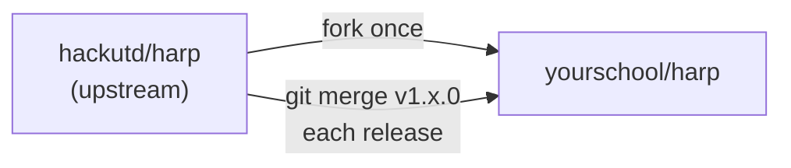

Adopters run Harp as a fork: `hackutd/harp` stays generic, and each school's fork changes branding and configuration. Ideally nothing else. The payoff is that merging an upstream release (`git merge v1.x.0`) stays clean year after year.

<Note>
  Contributing a fix or feature back to Harp itself does not require a fork. Clone and open a PR directly, see [Contributing](/harp/contributing). Forking is for running your own hackathon on Harp.
</Note>

{/* Diagram: a git-history style diagram. Upstream main with release tags v1.3.0 and v1.4.0 on top; below it a fork branch that diverges with two small commits ("branding", "env config") and merge arrows pulling in each upstream tag cleanly. */}

## The fork model

- Keep upstream as a git remote and merge tagged releases, not arbitrary commits.
- Keep your fork's changes few, additive, and isolated to the surfaces meant for you: branding and environment configuration.
- Prefer a runtime setting over a code or schema change wherever the choice exists. Settings never conflict on merge.

## Migrations: the one sharp edge

Database migrations are numbered contiguously, and the migration tool tracks a single version number. That makes migration numbering load-bearing: a fork that adds its own migration will eventually collide with an upstream release that claims the same number.

The rules, in short:

- Expect collisions; CI catches them with a duplicate-version check.
- On conflict, renumber your migration above upstream's new maximum. Never renumber upstream's.
- Keep fork migrations rare and additive (new columns or tables), and do the renumbering before your next event, not during it.

See [Migrations for forks](/harp/reference/migrations) for the full procedure, including what to do if your migration already ran in production.

## Yearly rhythm

1. After your event, run the annual reset.
2. Merge the latest upstream release into your fork.
3. Re-verify your branding and env configuration still apply cleanly.
4. Redesign your marketing site for the new theme.
