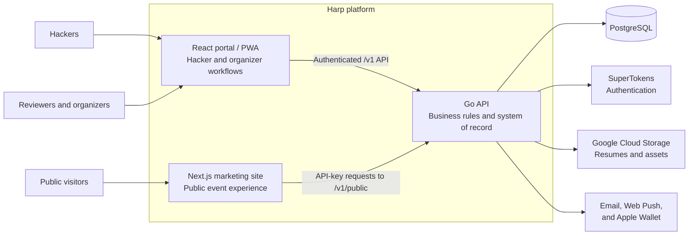

Harp is three services around one source of truth: a Go API, a React portal for authenticated users, and a Next.js marketing site for the public.

## The three services

| Service | Responsibility |
| --- | --- |
| Go API | Owns business logic, authorization, applications, reviews, decisions, event operations, public content, and persistence. Lives in `cmd/api` and `internal/`. |
| React portal | The authenticated hacker, admin, and super-admin experience, a Vite-powered PWA in `client/portal`. In production it's compiled into the API's Docker image and served as static files by the Go binary. |
| Next.js marketing site | The public event website. It renders schedules, sponsors, and FAQs fetched from the API's public endpoints. |

## Why the marketing site is separate

The portal and API are the stable platform: they carry over from year to year. The marketing site is the opposite. Every iteration of a hackathon should redesign it to match that year's theme and identity.

Keeping it as a separate application with a narrow contract (the [public content API](/harp/reference/public-api)) means a fresh public experience never requires touching the platform. The marketing codebase is intentionally a basic template: a scaffold page that proves the backend connection, plus a data layer that consumes the public endpoints. You throw away the design each year and keep the data layer. See [The marketing site](/harp/adoption/marketing-site).

## Platform services

- SuperTokens for authentication and OAuth (open source, managed or self-hosted)
- PostgreSQL as the system of record
- Google Cloud Storage for resumes and assets (optional in local dev)
- SendGrid or SMTP for decision and notification emails
- Web Push (VAPID) for browser push notifications
- Apple Wallet for optional `.pkpass` event passes

## Technology at a glance

- Backend: Go, Chi, PostgreSQL (pgx)
- Portal: React, TypeScript, Vite, Tailwind CSS, shadcn/ui
- Marketing: Next.js, React, TypeScript, Tailwind CSS
- Delivery: Docker-based local and production workflows
