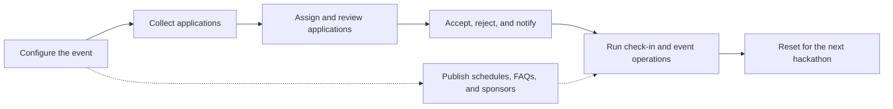

<Warning>
  WORK IN PROGRESS - Reach out to [caleb.bae@acmutd.co](mailto:caleb.bae@acmutd.co) if you would like to adopt Harp
</Warning>

Harp (Hacker Applications & Review Platform) is HackUTD's open-source platform for running a hackathon end to end. It covers everything from the moment applications open to the final day of the event: applications, review workflows, acceptance decisions, check-ins, meals, schedules, and public event content.

Harp is built to be adopted. Any school can run it for their own hackathon, because the event's name, dates, application form, scan types, FAQs, sponsors, and schedule are all runtime settings rather than code.

## The full event lifecycle

## Where to go next

<Columns cols={2}>
  <Card title="Why Harp?" icon="lightbulb" href="/harp/why-harp">
    What Harp replaces and why it exists.
  </Card>
  <Card title="Features" icon="sparkles" href="/harp/features/hackers">
    Everything the platform does, from applications to event day.
  </Card>
  <Card title="Architecture" icon="sitemap" href="/harp/architecture">
    The three services and how they fit together.
  </Card>
  <Card title="Adopting Harp" icon="rocket" href="/harp/adoption/guide">
    Run Harp for your own hackathon.
  </Card>
  <Card title="Deployment" icon="server" href="/harp/deployment/local">
    Local development and production deployment.
  </Card>
  <Card title="Contributing" icon="code-pull-request" href="/harp/contributing">
    Work on Harp itself.
  </Card>
</Columns>

<Note>
  Looking for deep technical detail? The [DeepWiki technical documentation](https://deepwiki.com/hackutd/harp) covers architecture, APIs, and internals generated from the source.
</Note>
